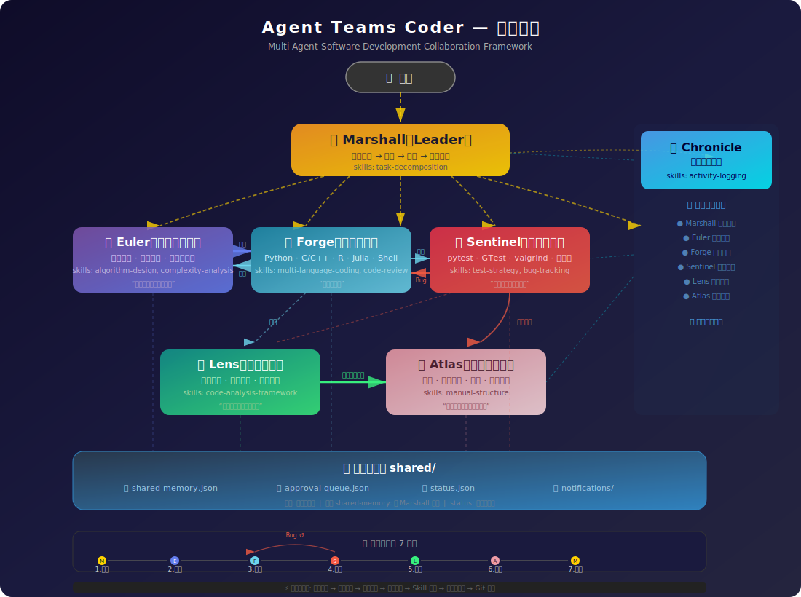

# Agent Teams Coder

> A multi-agent software development collaboration framework powered by Claude Code. Seven specialized AI agents work together under a strict shared memory governance model.

<p align="center">
  
</p>

## Team Members

| Codename      | Role                   | Key Skills                                                       |
| ------------- | ---------------------- | ---------------------------------------------------------------- |
| **Marshall**  | Leader                 | Task decomposition, assignment, memory approval, delivery        |
| **Euler**     | Algorithm Designer     | Algorithm design, mathematical modeling, complexity analysis     |
| **Forge**     | Code Developer         | Python, C, C++, R, Julia, Shell — strict coding standards        |
| **Sentinel**  | Code Tester            | pytest, GTest, valgrind, coverage analysis, bug tracking         |
| **Lens**      | Code Analyst           | Architecture analysis, function-level & line-by-line explanation |
| **Atlas**     | Documentation Engineer | Software manual (intro, usage, examples, code explanation)       |
| **Chronicle** | Log Recorder           | Activity logging, session summaries, update reports              |

## Standard Workflow

```
Phase 1: Requirements   → Marshall decomposes requirements, Chronicle starts logging
Phase 2: Algorithm       → Euler designs algorithm, aligns with Forge
Phase 3: Development     → Forge implements code based on Euler's algorithm
Phase 4: Testing         → Sentinel tests rigorously, broadcasts test report
Phase 5: Analysis        → Lens analyzes code structure, line-by-line explanation
Phase 6: Documentation   → Atlas integrates manual (test cases + code analysis)
Phase 7: Delivery        → Marshall consolidates, Chronicle generates summary
```

## Core Mechanisms

### 1. Shared Memory with Approval Governance

The shared memory (`shared-memory.json`) stores team-wide architectural decisions, API conventions, and coding standards. It is **protected by an approval mechanism**:

| Operation | Who                  | How                                                              |
| --------- | -------------------- | ---------------------------------------------------------------- |
| **Read**  | All members          | Direct file read — always allowed                                |
| **Write** | Members (non-Leader) | Submit request via `memory-request.sh` → Leader approves/rejects |
| **Write** | Marshall (Leader)    | Direct write via `memory-write.sh` — no approval needed          |

```bash
# Member submits a change request
bash scripts/memory-request.sh write "api_auth" "Use JWT tokens" "Standardize auth"

# Leader approves
bash scripts/memory-approve.sh req_20260317120000_42

# Leader rejects
bash scripts/memory-reject.sh req_20260317120000_42 "Conflicts with existing decision"
```

### 2. Seven-Point Mandatory Checkpoint

Every agent must complete these 7 steps **before executing any task**:

| Step | Check                    | Purpose                                     |
| ---- | ------------------------ | ------------------------------------------- |
| 1    | Task scope confirmation  | Prevent overreach or misunderstanding       |
| 2    | Shared memory read       | Ensure compliance with team conventions     |
| 3    | Smart notification check | Don't miss teammate messages (mtime-cached) |
| 4    | Team status sync         | Read current phase, update own status       |
| 5    | Skill applicability      | Use specialized skill if available          |
| 6    | Task decomposability     | Split if >= 3 steps or multi-file           |
| 7    | Git operation detection  | Require explicit user authorization         |

Violation triggers auto-correction: stop → restart from step 1.

### 3. Real-Time Team Status (`status.json`)

```bash
# Member updates their own status
bash scripts/update-status.sh forge working "Implementing sort algorithm"
bash scripts/update-status.sh sentinel blocked "" "Waiting for Forge"

# Marshall updates workflow phase
bash scripts/update-phase.sh 3 "Sort library development"
```

Status values: `idle` | `working` | `blocked` | `waiting` | `done`

### 4. Skill System

Each agent has exclusive skill files in their `skills/` directory with standardized workflows, templates, and checklists.

| Agent     | Skills                                                 |
| --------- | ------------------------------------------------------ |
| Marshall  | `task-decomposition.md`                                |
| Euler     | `algorithm-design.md`, `complexity-analysis.md`        |
| Forge     | `multi-language-coding.md`, `code-review-checklist.md` |
| Sentinel  | `test-strategy.md`, `bug-tracking.md`                  |
| Lens      | `code-analysis-framework.md`                           |
| Atlas     | `manual-structure.md`                                  |
| Chronicle | `activity-logging.md`                                  |

### 5. Notification System

File-based async notifications with mtime caching (97% token savings when no changes):

```bash
# Send notification
bash scripts/notify.sh euler forge "Algorithm ready" "Sorting algorithm design complete"

# Broadcast to all
bash scripts/notify.sh marshall all "Phase update" "Entering testing phase"

# Check notifications (mtime-cached)
bash scripts/check-notify.sh forge
```

### 6. Model Selection per Agent

```bash
./start-euler.sh           # Default: Sonnet
./start-euler.sh opus      # Opus for complex algorithm design
./start-chronicle.sh haiku # Haiku for logging (cost-efficient)
```

## Prerequisites

- Claude Code v2.1.32+ (`claude --version`)
- Enable Agent Teams:
  ```json
  { "env": { "CLAUDE_CODE_EXPERIMENTAL_AGENT_TEAMS": "1" } }
  ```
- tmux (optional, for `panel.sh` multi-pane launch)

## Quick Start

### Option 1: Launch individual agents

```bash
./start-leader.sh      # Marshall (Leader)
./start-euler.sh       # Euler (Algorithm Designer)
./start-forge.sh       # Forge (Developer)
./start-sentinel.sh    # Sentinel (Tester)
./start-lens.sh        # Lens (Analyst)
./start-atlas.sh       # Atlas (Documentation)
./start-chronicle.sh   # Chronicle (Logger)
```

### Option 2: tmux multi-pane panel

```bash
./panel.sh
# Options:
#   a) Full team — all 7 agents
#   b) Core dev — Marshall + Euler + Forge + Sentinel
#   c) Leader only
#   d) Algorithm + Dev — Euler + Forge
#   e) Test + Analysis + Docs — Sentinel + Lens + Atlas
```

### Option 3: Launch from Marshall via Agent Teams

In Marshall's Claude Code session:

```
Create a team:
- Euler: Algorithm design, working directory ../euler
- Forge: Code development, working directory ../forge
- Sentinel: Code testing, working directory ../sentinel
- Lens: Code analysis, working directory ../lens
- Atlas: Documentation, working directory ../atlas
- Chronicle: Activity logging, working directory ../chronicle

Then decompose and assign: [your requirements]
```

## Project Structure

```
agent_team/
├── CLAUDE.md                          # Project-level instructions (shared)
├── README.md
├── .gitignore
│
├── leader/                            # Marshall
│   ├── CLAUDE.md                      #   Behavior instructions
│   ├── PERSONA.md                     #   Personality definition
│   └── skills/                        #   Exclusive skills
│       └── task-decomposition.md
│
├── euler/                             # Euler
│   ├── CLAUDE.md
│   ├── PERSONA.md
│   └── skills/
│       ├── algorithm-design.md
│       └── complexity-analysis.md
│
├── forge/                             # Forge
│   ├── CLAUDE.md
│   ├── PERSONA.md
│   └── skills/
│       ├── multi-language-coding.md
│       └── code-review-checklist.md
│
├── sentinel/                          # Sentinel
│   ├── CLAUDE.md
│   ├── PERSONA.md
│   └── skills/
│       ├── test-strategy.md
│       └── bug-tracking.md
│
├── lens/                              # Lens
│   ├── CLAUDE.md
│   ├── PERSONA.md
│   └── skills/
│       └── code-analysis-framework.md
│
├── atlas/                             # Atlas
│   ├── CLAUDE.md
│   ├── PERSONA.md
│   └── skills/
│       └── manual-structure.md
│
├── chronicle/                         # Chronicle
│   ├── CLAUDE.md
│   ├── PERSONA.md
│   └── skills/
│       └── activity-logging.md
│
├── shared/                            # Shared workspace
│   ├── memory/
│   │   ├── shared-memory.json         #   Protected shared memory
│   │   ├── approval-queue.json        #   Approval queue
│   │   └── status.json                #   Real-time team status
│   ├── tasks/                         #   Task records & logs
│   ├── notifications/                 #   Notification files
│   └── templates/
│       ├── prd.md
│       ├── bug.md
│       └── api.md
│
├── scripts/
│   ├── memory-request.sh              #   Submit memory change request
│   ├── memory-approve.sh              #   Leader approves request
│   ├── memory-reject.sh               #   Leader rejects request
│   ├── memory-write.sh                #   Leader direct write
│   ├── notify.sh                      #   Send notification
│   ├── check-notify.sh                #   Check notifications (mtime-cached)
│   ├── update-status.sh               #   Update member status
│   └── update-phase.sh                #   Update workflow phase
│
├── panel.sh                           #   tmux multi-pane launcher
├── start-leader.sh                    #   Individual agent launchers
├── start-euler.sh                     #     (all support model selection)
├── start-forge.sh
├── start-sentinel.sh
├── start-lens.sh
├── start-atlas.sh
└── start-chronicle.sh
```

## Collaboration Network

| Relationship     | Description                                                                                                      |
| ---------------- | ---------------------------------------------------------------------------------------------------------------- |
| Euler ↔ Forge    | Algorithm → Code: Euler provides algorithm + pseudocode, Forge implements and feeds back engineering constraints |
| Forge → Sentinel | Code → Test: Forge notifies Sentinel when code is ready                                                          |
| Sentinel → Forge | Bug → Fix: Sentinel reports bugs, Forge fixes, regression test loop                                              |
| Lens → Atlas     | Analysis → Docs: Lens provides line-by-line code explanation for Atlas                                           |
| Sentinel → Atlas | Tests → Docs: Sentinel provides test cases, Atlas converts to usage examples                                     |
| Chronicle ← All  | Logging: Chronicle monitors all member activities                                                                |

### Atlas Manual — Four Chapters

| Chapter                               | Source                                               |
| ------------------------------------- | ---------------------------------------------------- |
| Part 1: Software Introduction         | Forge (architecture) + Euler (algorithm description) |
| Part 2: User Guide                    | Forge (API/interface info) + Atlas                   |
| Part 3: Usage Examples                | Sentinel (test cases converted)                      |
| Part 4: Line-by-Line Code Explanation | Lens (code analysis report)                          |

## License

MIT
