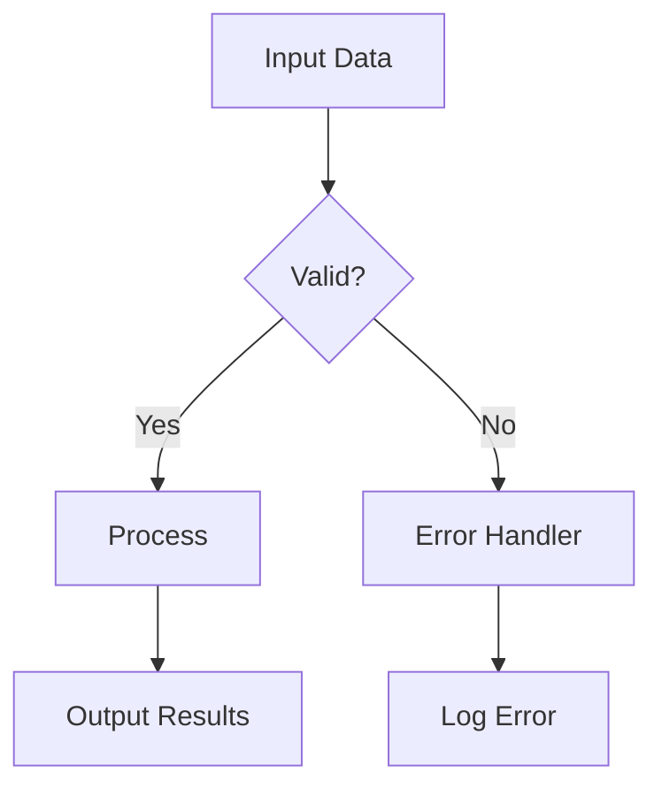
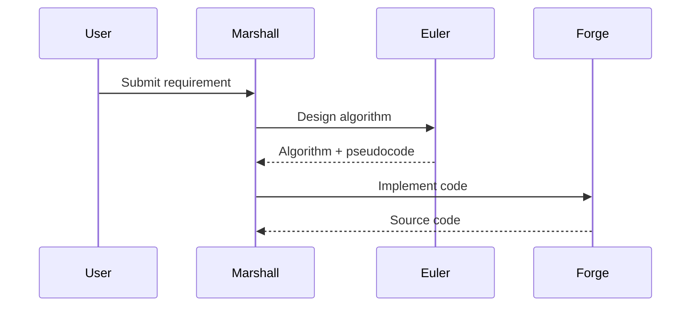
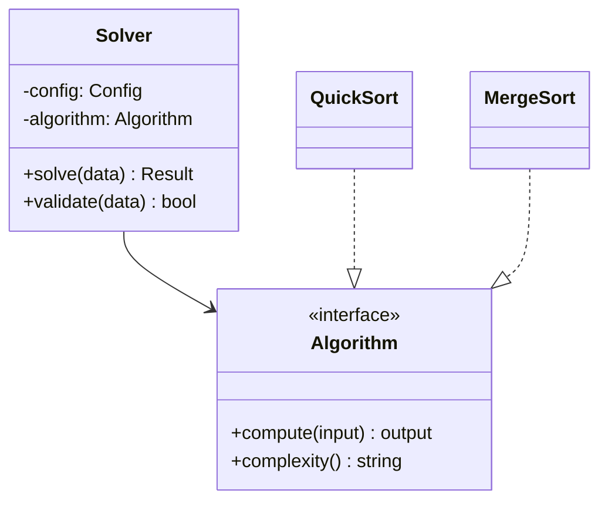
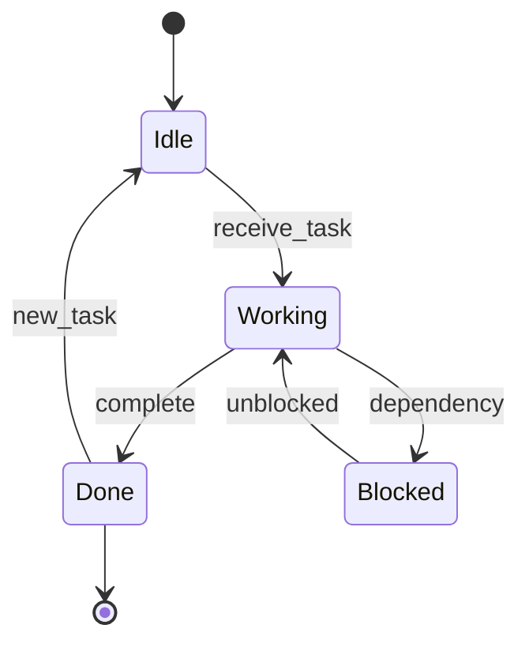

# Skill: Diagram Generation

## Trigger

When documentation needs visual aids — architecture diagrams, flow charts, data flow, class diagrams.

## Mermaid (GitHub-native rendering)

### Flowchart



### Sequence Diagram



### Class Diagram



### State Diagram



## ASCII Diagrams (universal fallback)

### Architecture

```
┌─────────────┐     ┌─────────────┐
│   Frontend   │────→│   Backend   │
│  (React)     │←────│  (FastAPI)  │
└─────────────┘     └──────┬──────┘
                           │
                    ┌──────▼──────┐
                    │  Database   │
                    │ (PostgreSQL)│
                    └─────────────┘
```

### Data Flow

```
Raw CSV ──→ [Parser] ──→ DataFrame ──→ [Filter] ──→ Clean Data
                                                        │
                                                   [Analyzer]
                                                        │
                                                   ┌────▼────┐
                                              Report    Plot
```

## When to Use Which

| Diagram Type | Best For                        | Tool                   |
| ------------ | ------------------------------- | ---------------------- |
| Flowchart    | Algorithm logic, decision trees | Mermaid                |
| Sequence     | API calls, agent communication  | Mermaid                |
| Class        | OOP structure, interfaces       | Mermaid                |
| Architecture | System overview, deployment     | ASCII or Mermaid       |
| Data Flow    | Input → Processing → Output     | ASCII                  |
| Call Graph   | Function relationships          | ASCII tree (from Lens) |

## Checklist

- [ ] Every diagram has a title/caption
- [ ] Color/style used consistently
- [ ] ASCII version available as fallback
- [ ] Diagrams match actual code (not aspirational)
- [ ] Max ~15 nodes per diagram (split if larger)
