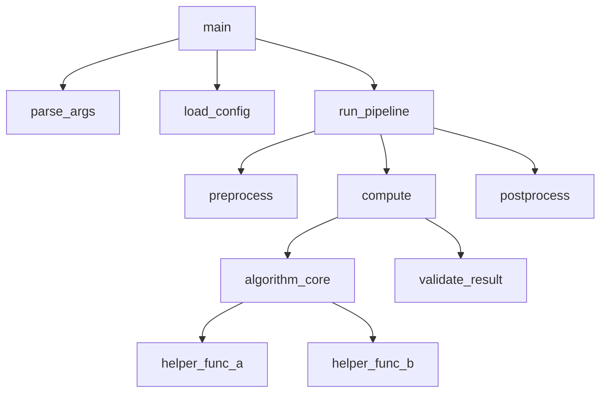

# Skill: Call Graph Generation

## Trigger

When mapping function call relationships, module dependencies, or data flow.

## Call Graph Formats

### Mermaid (GitHub-rendered)



### ASCII (universal)

```
main()
├── parse_args()
├── load_config()
└── run_pipeline()
    ├── preprocess()
    │   └── validate_input()
    ├── compute()
    │   ├── algorithm_core()
    │   │   ├── helper_a()
    │   │   └── helper_b()
    │   └── validate_result()
    └── postprocess()
        └── format_output()
```

## Dependency Graph (Module Level)

```
┌──────────┐    ┌──────────┐    ┌──────────┐
│  cli.py  │───→│  core.py │───→│ utils.py │
└──────────┘    └────┬─────┘    └──────────┘
                     │
                     ▼
                ┌──────────┐    ┌──────────┐
                │ algo.py  │───→│ math_ext │
                └──────────┘    └──────────┘
```

## Data Flow Diagram

```
Input File ──→ [Parser] ──→ Raw Data
                              │
                              ▼
                         [Validator] ──→ Errors ──→ Error Log
                              │
                              ▼ (valid)
                         [Processor] ──→ Results
                              │
                              ▼
                         [Formatter] ──→ Output File
```

## Generation Process

1. **Identify entry points** — main(), CLI commands, public API
2. **Trace calls** — For each entry point, follow function calls recursively
3. **Mark boundaries** — Internal vs external (library) calls
4. **Note data types** — What flows between functions (types, shapes)
5. **Identify hot paths** — Most-called functions, performance-critical chains
6. **Flag circular deps** — Module A imports B imports A → problem

## Checklist

- [ ] Entry points identified
- [ ] All public functions included in graph
- [ ] External dependencies marked distinctly
- [ ] Circular dependencies flagged
- [ ] Data types annotated on edges
- [ ] Graph is readable (max ~20 nodes per diagram, split if larger)
