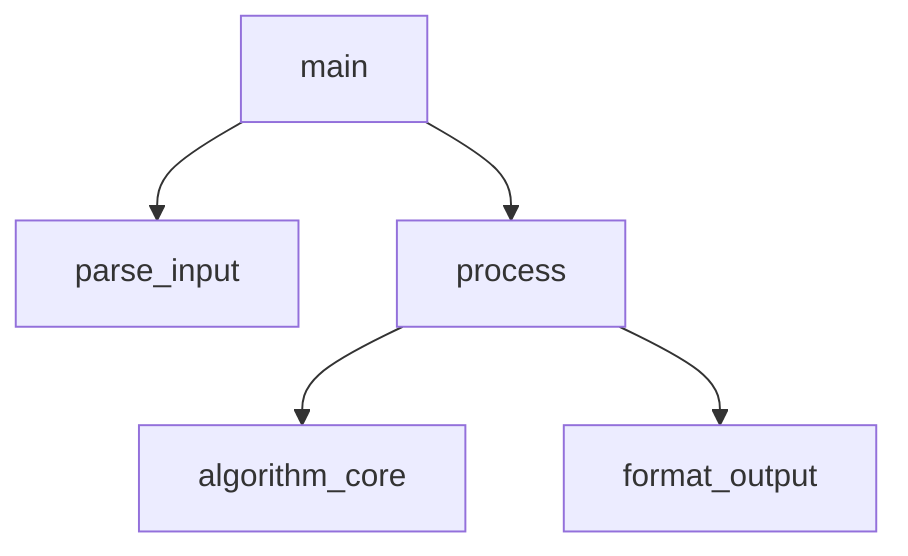

# Skill: 代码分析框架

## 触发条件

收到代码分析任务时使用，提供系统化的分析方法。

## 分析层次（由宏观到微观）

### 第 1 层: 架构鸟瞰

- 文件/模块组织方式
- 入口点在哪
- 核心数据结构是什么
- 依赖关系图

### 第 2 层: 模块职责

- 每个文件/模块做什么
- 模块间的接口是什么
- 哪些是公共 API，哪些是内部实现

### 第 3 层: 函数详解

- 功能：一句话说明
- 参数和返回值
- 副作用（修改全局状态？I/O？）
- 算法逻辑（引用 Euler（算法设计师）的方案）

### 第 4 层: 逐行解释

- 关键代码段逐行注释
- 每行说明"做什么"和"为什么"
- 标注非显然的技巧和优化

## 图表工具

### 调用关系图（Mermaid）



### 数据流图（ASCII）

```
输入 → 解析 → 验证 → 核心处理 → 格式化 → 输出
                ↓
              错误处理 → 错误输出
```

## 分析检查清单

- [ ] 入口点已识别
- [ ] 所有公共函数已分析
- [ ] 调用关系图已绘制
- [ ] 数据流已追踪
- [ ] 关键代码段已逐行解释
- [ ] 设计模式已识别
- [ ] 已与 Euler（算法设计师）确认算法意图
- [ ] 分析报告已发送给 Atlas（文档工程师）
